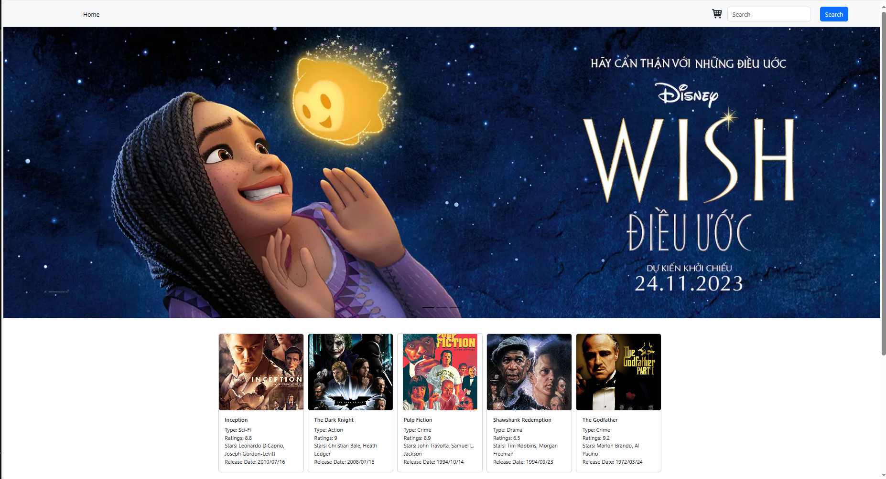

# Cinemx

A complete React js movie application.

---

### Made with ❤️ by [Anh Nguyen](https://github.com/NguyenCongAnh1)

---

## Project Description

Cinemx contains all the functionalities that a movie website should have. Users can search for any movie and the site will filter results and display them on a beautiful screen. Also, users can show all the trending movies. Users can see popular, top-rated movies. Users can see a single movie's details by clicking on a specific movie. Bottom of the movie details page, the user can show related official videos. Anyone can see what is similar movies to the movie on the details page. Anyone can play the movie trailer. Users can add the movie to cart and checkout.

## What I used

- [React](https://reactjs.org/)
- [React Redux](https://redux.js.org/)
- [The Movie Database API](https://www.themoviedb.org/)
- [React icons](https://react-icons.github.io/react-icons/)
- [Vite](https://vitejs.dev/)
- More...

## Requirements

- Basic ReactJs knowledge
- Basic HTML, SCSS knowledge

## Getting Started

Clone the Repository in master branch

```shell
git clone https://github.com/NguyenCongAnh1/ReactJs-final-project.git
```

After getting the starter files, you need to go the file directory and run

1. Frontend

```shell
npm install
npm run dev
```

2. Backend

```shell
cd .\crud-json\
npm install
npm run start:watch
```

## Tools Used

Code Editor: [VS Code](https://code.visualstudio.com/)

---

## FAQ

### Q: What are the prerequisites?

basics of html, css, javascript and some basic knowledge of react is enough to start this project. Rest you will learn in the tutorial.

### Q: Who the project is for?

The project is for the people who wanna get more skilled in `ReactJs`.

---

# Features

## View Movie List

Explore our extensive collection of films and discover new releases.


## Single movie detail
You can click on the movie image you want to see details

## Play trailer


## Search movie
You can search by the fields on name, type, ratings and name of stars


## Add to cart
You can see add to cart button in the details page, click to add to cart
## Cart
Where information related to payment is displayed, you can increase, decrease or remove the corresponding items.


